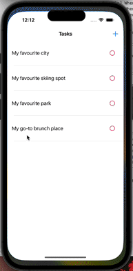

# Project 4 - *Photo Scavenger HUNT*

Submitted by: **Chun Sheung Ng (Derrick)**

**Photo Scavenger Hunt** is an app that allows user to create items (tasks) to choose/take photos with metadata, load the information into the App, then use MapKit to indicate the image location and the image view.

Time spent: **5** hours spent in total

## Required Features

The following **required** functionality is completed:

- [x] App displays list of hard-coded tasks
- [x] When a task is tapped it navigates the user to a task detail view
- [x] When user adds photo to complete the tasks, it marks the task as complete
- [x] When adding photo of task, the location is added
- [x] User returns to home page (list of tasks) and the status of your task is updated to complete
 
The following **optional** features are implemented:

- [x] User can launch camera to snap a picture (tested with personal iPhone)    

The following **additional** features are implemented:

- [x] App icon of sizes for multiple devices
- [x] Additional view controller "TaskComposeViewController" to let user create their own items/tasks

## Video Walkthrough

Here's a walkthrough of implemented user stories:

<!--  -->

<!---->
<!-- Replace this with whatever GIF tool you used! -->
GIF created with ...  
<!-- Recommended tools:
[Kap](https://getkap.co/) for macOS
[ScreenToGif](https://www.screentogif.com/) for Windows
[peek](https://github.com/phw/peek) for Linux. -->

## Notes

Describe any challenges encountered while building the app.

## License

    Copyright [2023] [Chun Sheung Ng (Derrick)]

    Licensed under the Apache License, Version 2.0 (the "License");
    you may not use this file except in compliance with the License.
    You may obtain a copy of the License at

        http://www.apache.org/licenses/LICENSE-2.0

    Unless required by applicable law or agreed to in writing, software
    distributed under the License is distributed on an "AS IS" BASIS,
    WITHOUT WARRANTIES OR CONDITIONS OF ANY KIND, either express or implied.
    See the License for the specific language governing permissions and
    limitations under the License.

